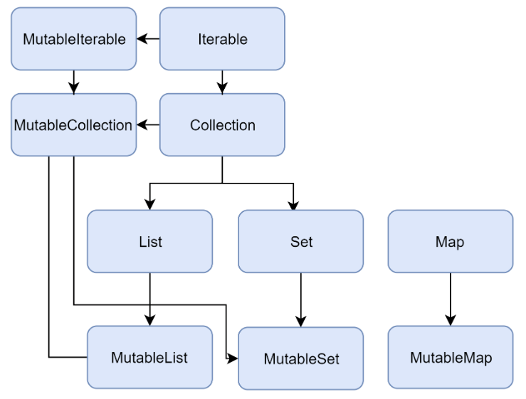

# 09. 컬렉션

# 컬렉션의 구조와 기본

컬렉션은 기초적인 자료구조를 모아놓은 라이브러리.

## 코틀린의 컬렉션

### 컬렉션의 종류

자바와 다르게 List, Set, Map이 불변형, 가변형이 있다.

변수 선언을 val로 하는것 과 같이 불변형을 사용하는 것을 권장합니다.

**불변형, 가변형 자료형의 생성 헬퍼 함수**

|컬렉션|불변형|가변형|
|---|---|---|
| List | listOf | mutableListOf, arrayListOf |
| Set | setOf | mutableSetOf, hashSetOf, linkedSetOf, sortedSetOf |
| Map | mapOf | mutableMapOf, hashMapOf, linkedMapOf, sortedMapOf |

### 컬렉션 인터페이스

**Iterable**

    public interface Iterable<out T> {
        public operator fun iterator(): Iterator<T>
    }

컬렉션이 연속적인 요소를 표현할 수 있게 합니다.

hasNext(), next()를 가지고 요소를 순환 할 수 있습니다.

형식 매개변수는 공변성을 제공하도록 out으로 선언됨을 볼 수 있습니다.

**Collection**

Iterable이 확장된 Collection인터페이스는 불변형입니다.

**주요 멤버 프로퍼티와 메서드**

size, isEmpty(), contains(element: E), containsAll(elements: Collections<E>)

**MutableIterable, MutableCollection**

가변형 컬렉션을 지원하기 위해 준비된 인터페이스

다음과 같은 추가, 삭제 메서드를 구현할 수 있습니다.

add(element: E), remove(element: E), addAll(element: E), removeAll(element: Collection<E>), retainAll(elements: Collection<E>), clear()

# List 활용하기

List는 순서에 따라 정렬된 요소를 컬렉션

## 불변형 List 생성하기

### listOf() 함수

형식 매개변수<T>는 지정하지 않으면 <Any>가 기본값

    var numbers: List<Int> = listOf(1,2,3,4,5)
    var names: List<String> = listOf("one","two","three")

다음과 같이 서로 다른 요소를 합쳐서 선언할 수 도 있으며 Any타입을 가집니다.

    var mixedTypes = listOf("Hello", 1, 0,11, 's')

### 컬렌션 반복하기

    val fruits = listOf("apple", "banana", "kiwi")
    
    // 
    for( item in fruits){
    	println(item)
    }
    
    // indices 멤버를 이용한 인덱스 접근 
    for(index in fruits.indices){
    	println("fruits[$index] = ${fruits[index]}")
    }
    
    // 응용 : 짝수
    for(index in fruits.indices){
    	if(index%2==0) println("fruits[$index] = ${fruits[index]}")
    }

### emptyList()함수

이 함수는 반드시 형식 매개변수를 지정해야 합니다.

    val emptyList: List<String> = emptyList<String>()

### listOfNotNull() 함수

null이 아닌 요소만 이용하여 리스트를 구성

    val nonNullsList: List<Int> = listOfNotNull(1,2,null,4,5)
    [1,2,4,5]

### List의 주요 멤버 메서드

get(index: Int), indexOf(element: E), lastIndexOf(element: E), listIterator(), subList(fromIndex: Int, toIndex: Int)

## 가변형 List 생성하기

add()와 remove()를 이용하여 요소를 추가하거나 삭제할 수 있습니다.

### 가변형 arrayListOf() 함수

컴파일할 때 반환되는 자료형은 ArrayList입니다.

### 가변형 mutableListOf() 함수

    val mutableList = mutableListOf("A", "B", "C" )
    mutableList.add("Z")
    mutableList[0] = "X"
    
    //자료형 혼합
    val mutableListMixed = mutableListOf("Android", 5, 6, "Apple")

대괄호, set()표현을 이용해서 해당하는 요소를 바로 변경할 수 있습니다.

마지막 줄과 같이 여러가지 자료형으로 구성된 MutableList를 할당할 수도 있습니다.

?? 위의 두가지는 arrayListOf로도 똑같이 되는데 뭐가 다르지??

기존 List에서 toMutableList()를 사용할 수 있습니다. 기존 데이터를 그대로 갖는 새로운 MutableList를 만들며 데이터를 추가 제거 할 수 있습니다.

### List와 배열 차이

배열은 고정된 크기를 갖습니다.

Array<T>는 무변성이므로 Array<Int>와 Array<Number>는 무관합니다.

MutableList<T> 역시 무변성

List<T>의 경우 공변성을 가지므로 List<Int>가 List<Number>에 지정될 수 있습니다.

※ 무변성과 공변성은 8-1 참고

# Set과 Map 활용하기

### Set

집합의 개념

요소가 유일함.

### Map

요소가 키와 값으로 쌍 형태로 저장됩니다.

키는 중복될 수 없고 유일합니다.

값은 중복 될 수 있습니다.

## Set 생성하기

### 불변형 setOf()

### 가변형 mutableSetOf()

MutableSet 인터페이스 자료형을 반환하지만, 내부적으로 자바의 LinkedHashSet을 만들어 냅니다.

## Set의 여러가지 자료구조

### HashSetOf()

해시 테이블에 요소를 저장하는 자바의 HashSet을 만듭니다.

불변성 기능이 없기 때문에 추가 삭제가 가능합니다.(가변성 Set)

정렬 기능은 없지만 성능은 좋습니다.

### sortedSetOf()

자바의 TreeSet 자료형을 정렬된 상태로 반환합니다.

이 함수는 java.util.* 패키지가 임포트 됩니다. ?? 안해도 써지는데요 ??

삽입, 삭제 성능이 떨어지지만 검색과 정렬이 뛰어납니다.

가변성 Set 입니다.

### linkedSetOf()

자바의 LinkedHashSet 자료형을 반환합니다.

HashSet, TreeSet보다는 느리지만 메모리 저장 공간을 좀 더 효율적으로 사용할 수 있습니다.

## Map의 활용

### 불변형 mapOf() 함수

    val map: Map<키 자료형, 값 자료형> = mapOf(키 to 값[,...])
    
    val map = mapOf(11 to "JAVA", 22 to "Kotlin", 33 to "C++")
    
    // 키와 값을 출력
    for((key, value) in map){
    	println("$key $value")
    }
    
    // 키 22의 값 출력
    println("${map[key]}")
    
    // 맵의 모든 키 출력
    println("${map.keys}")

**Map에서 사용되는 주요 멤버 메서드와 프로퍼티**

size, keys, values, isEmpty(), containsKey(key: K), containsValue(value: V), get(key: K)

### 가변형 mutableMapOf() 함수

**mutableMap에서 사용되는 주요 멤버 메서드와 프로퍼티**

put(key: K, value: V), remove(key: K), putAll(from: Map<out K, V>), clear()

### Map의 기타 자료구조

Set과 비슷하게 HashMAp, SortedMap, LinkedHashMap을 이용 가능합니다.

hashMapOf(), sortedMapOf(), linkedMapOf()로 각각 초기화 할 수 있습니다.

# 컬렉션의 확장 함수

코틀린에서는 컬렉션에 많은 확장 함수를 제공합니다.

- 연산자 : 더하고 빼는 등
- 집계 : 최대, 최소, 집합, 총합 등
- 검사 : 요소를 검사하고 순환하는 기능
- 필터 : 원하는 요소를 골라내는 기능
- 변환 : 뒤집기, 정렬, 자르기 등

## 컬렉션의 연산

    val list1 = listOf("one", "two", "three")
    
    // + 연산자를 이용한 문자열 요소 추가
    list1 + "four"
    
    // + 연산자를 이용한 두 List의 병합
    list1 + listOf("A", "B", "C")
    
    // ※ 연산의 결과가 list에 담겨지지 않으며, += 연산자가 사용이 안됨.
    
    // 요소 제거
    list1 - "one"
    
    // 일치하는 요소 제거
    list1 - list("one", "five")
    
    
    val map = mapOf("hi" to 1, "hello" to 2, "Goodbye" to 3)
    
    //pair를 이용한 map에 요소 추가
    map + Pair("Bye", 4)
    
    // 값의 제거 (키)
    map - "hi"
    
    // List를 이용한 값의 제거 (키)
    map - listOf("hi", "hello")
    
    // Map의 병합
    map + mapOf("Apple" to 4, "Orange" to 5)

## 요소의 처리와 집계

### 요소의 순환 forEach, forEachIndexed, onEach

    list.forEach{	println(it) }
    list.forEachIndexed{index, value -> println("$index, $value")}
    
    // onEach 각 요소를 forEach와 똑같이 처리 후 컬렉션을 반환
    // 반환된 컬렉션도 기존 컬렉션과 메모리 주소값이 같음
    val list2 = list.onEach{ println(it) }

### 요소의 개수 반환 count

    // 조건에 맞는 요소 개수 반환
    list.count{ it % 2 == 0 }

### 최댓값과 최솟값의 요소 반환 max, min, maxBy, minBy

    list.max()
    list.min()
    
    map.maxBy{it.key}
    map.minBy{it.value}
    
    // ※ 아무 값도 넣지 않으면 컴파일시 에러남, IDE에서는 안잡아줌! 이상함.
    map.minBy{ }

### 각 요소에 정해진 식 적용하기 fold, foldRight, reduce, reduceRight

    // fold : 초기값과 처음 요소부터 끝 요소까지 식에 적용하여 값을 생성
    val list = listOf(1,2,3,4,5)
    
    list.fold(6){total, next -> total + next}
    // 6 + 1 + 2 + 3 + 4 + 5
    
    // foldRight fold의 요소를 끝부터 앞으로
    list.foldRight(6){total, next -> total * next}
    // 6 * 5 * 4 * 3 * 2 * 1
    
    
    // reduce : fold와 같지만 초기값을 사용하지 않음
    list.reduce{total, next -> total + next}
    // 1 + 2 + 3 + 4 + 5
    
    // reduceRight
    list.reduce{total, next -> total * next}
    // 5 * 4 * 3 * 2 * 1

### 모든 요소 합산하기 sum, sumBy

    list.sum()
    
    // 식에 의해 도출된 요소를 합한 결과를 반환
    list.sumBy{it}
    // ※ 아무 값도 넣지 않으면 컴파일시 에러남, IDE에서는 안잡아줌! 이상함.
    
    // 객체의 값을 지정할 수도있음
    list.sumBy{it.price}

## 요소의 검사

### 요소의 일치 여부 검사 all, any

    // all: 모든 요소가 조건에 맞으면 true를 반환
    list.all{it < 10} 
    
    // any: 최소한 하나의 요소가 일치하면 true를 반환
    list.any{it < 1}

### 특정 요소의 포함 여부 검사하기 contains, containsAll, in

    list.contains(2)
    2 in list
    
    // containsAll: 모든 요소가 포함되어 있을때 true 반환
    list.containsAll(listOf(1,2,3))

### 요소의 존재 여부 검사하기 none, isEmpty, isNotEmpty

    // none: 요소가 없으면 true
    list.none()
    // 수식 사용 가능
    list.none{ it > 6 } // 6보다 큰 요소가 없으면 true
    
    // isEmpty 컬렉션이 비어있는지 아닌지 검사
    list.isEmpty()
    
    // isNotEmpty: 비어있지 않으면 true
    list.isNotEmpty()

## 요소의 필터와 추출

### 특정 요소를 골라내기 filter, filterNot, filterNotNull

    // filter: 수식에 따라 요소를 골라내기
    list.filter { it % 2 == 0 } // 짝수
     
    // filterNot: 수식에 해당하지 않는 요소 골라내기
    list.filterNot { it % 2 == 0 } // 홀수
    
    // filterNotNull: Null을 제외
    list.filterNotNull()

### 인덱스와 함께 골라내기 filterIndexed, filterIndexedTo

    // filterIndexed: 인덱스와 함께 추출
    list.filertIndexed { idx, value -> idx != 1 && value % 2 == 0 }
    
    // filterIndexedTo: 인텍스와 함께 추출하며, 이후 가변형 컬렉션으로 변환
    list.filterIndexedTo(mutableListOf()){ idx, value -> idx != 1 && value % 2 == 0  }

### Map에서의 골라내기 filterKey, filterValue

    // 맵에서는 filterKey와 filterValue를 이용하여 골라낼 수 있습니다.
    map.filterKey{ it != 11 }
    map.filterValue{ it == "JAVA" } 

### 여러 자료형을 담는 컬렉션에서 특정 타입만을 골라내기 filterIsInstance

    // 여러 자료형을 받는 컬렌션인 경우 filterIsInstance를 이용하여 골라낼 수 있습니다.
    list.filterIsInstance<String>()

### 특정 범위 잘라내거나 반환하기 slice, take, takeLast, takeWhile

    // slice 특정 인덱스의 요소만을 반환
    list.slice(listOf(0,2))
    
    // take: n개의 요소 반환
    list.take(2)
    
    // takeLast: 뒤에서 n개의 요소를 반환
    list.takeLast(2)
    
    // ※ 실제 요소보다 더 많은 요소를 가져오더라도 있는 만큼만 가져옴.
    
    // takeWhile: 조건에 맞을 경우 반환
    list.takeWhile{ it < 2 }
    ?? filer랑 어떤 차이 ??
    A: 일치하지 않는 값이 있으면 중단된다!

### 특정 요소 제외하기 drop, dropWhile, dropLastWhile

     // drop: 처음부터 n개의 요소를 제외하고 반환
    list.drop(3)
    
    // dropWhile: 조건식에 맞는것을 제외하고 반환
    list.dropWhile{it<3} //3보다 작은것을 제외하고 반환
    
    list.dropLastWhile{it>3} // 3보다 큰 값은 제외하고 반환

### 각 요소의 반환 componentN

    // componentN: N번째 요소를 가져옵니다. Index와 다르게 1부터 시작하며, 최대 5까지입니다.
    list.component1()

### 합집합과 교집합 distinct, intersect

    // distinct : 중복 요소를 1개로 취급하여 반환
    list.distinct()
    
    // intersect: 교집합 요소만 골라 반환
    list.intersect(listOf(3,4,5))

## 요소의 매핑

.map()은 식을 적용해 새로운 컬렉션을 만들 수 있게 해주는 메서드입니다.

주어진 컬렉션을 전혀 건드리지 않으므로 좀 더 안전합니다.

### map, mapIndexed, mapNotNull

    // map: 컬렉션에 주어진 식을 적요앟여 새로운 컬렌션 반환
    list.map{ it * 2 }
    
    // mapIndexed: 컬렌션을 인덱스를 포함하여 주어진 식을 적용해 새로운 컬렌션 반환
    list.mapIndexed{ idx, it -> index * it}
    
    // mapNotNull: Null을 제외하고 식을 적용합니다.(식의 결과가 null일땐 제외됨)
    list.mapNotNull{ it + 1 }

### flatMap, groupBy

    // flatMap: 각 요소에 식을 적용한 후 합침
    listOf("abc","12").flatMap{it.toList()}
    // [a,b,c,1,2]
    
    // groupBy: 주어진 식에 따라 그룹화 하고 map으로 반환
    list.groupby { if (it % 2 == 0) "even" else "odd" }
    // even = [0,2,4], odd=[1,3,5]

## 요소 처리와 검색

### elementAt, elementAtOrElse, elementAtOrNull

    // elementAt: 인덱스에 해당하는 요소 반환
    list.elementAt(1)
    // ※ index를 넘어가는 경우 에러가 발생
    
    // elementAtElse: 인덱스를 벗어나는 경우 식에 따라 결과 반환
    list.elementAtElse(10,{ 2 * it })
    
    // elementAtNull: 인덱스를 벗어나는 경우 null 반환
    list.elementAtNull(10)

### first, firstOrNull, last, lastOrNull

    // first: 식에 일치하는 첫 요소 반환
    list.first{ it == 1}
    // ※ 일치하는 값이 없는 경우 에러가 발생
    
    // firstOrNull: 식에 일치하는 값이 없으면 null 반환
    list.firstOrNull{ it == 1 }
    
    // last: 식에 일치하는 마지막 요소 반환
    list.last{ it == 1 }
    
    // lastOrNull: 식에 일치하는 갑싱 없으면 null 반환
    list.lastOrNull{ it == 1 }

### 요소에 해당하는 인덱스를 반환 indexOf, indexOfFirst, lastIndexOf, indexOfLast

    // indexOf: 요소에 일치하는 첫 인덱스 반환
    list.indexOf(4)
    
    // indexOfFirst: 식에 일치하는 첫 요소의 인덱스를 반환, 없으면 -1
    list.indexOfFirst{ it % 2 == 0 }
    
    // lastIndexOf: 주어진 요소에 일치하는 가장 마지막 인덱스 반환
    list.lastIndexOf(4)
    
    // indexOfLast: 식에 일치하는 마지막 요소의 인덱스를 반환, 없으면 -1
    list.indexOfLast{ it % 2 == 0 }

### 조건에 맞는 요소 하나 반환 single, singleOrNull

    // single: 수식에 맞는 요소 하나 반환
    list.single { it == 3 }
    // ※ 요소가 없거나 2개 이상일 경우 에러 발생
    
    // singleOrNull: 수식에 맞는 요소가 없거나 2개 이상일 경우 null 반환
    list.singleOrNull { it == 3 }

## 컬렉션의 분리와 병합

### 병합 union, plus

    // union: 컬렉션을 병합하고 중복된 요소 값은 하나만 유지  Set을 반환
    list.union(listOf(4,5,6))
    
    // plus: 중복 포함하여 합침, + 연산자와 같음  List를 반환
    list.plus(listOf(4,5,6))

### 분리 partition, zip

    // partition: 주어진 식(true, false)에 따라 2개의 컬렉션으로 분리하며 Pair로 반환 
    list.partition{it % 2 == 0}
    
    // zip: 2개의 컬렉션에서 동일한 인덱스끼리 Pair를 만들어 반환합니다.
    // 요소의 개수가 적은 컬렉션에 맞춰 Pair가 구성됩니다. 
    // e.g.) 요소가 3개인 것과 5개인것으로 zip 하면 3개 pair가 만들어짐
    list.zip(listOf(7,8))
    

## 순서와 정렬

### reverse, sorted, sortedBy, sotredDescending

    // reverse: 순서를 뒤집어서 반환
    list.reverse()
    
    // sotred: 요소를 오름차순 정렬한 후 정렬된 컬렉션 반환
    list.sorted()
    
    // sortedDescending: 내림차순 정렬
    list.sortedDescending()
    
    // sortedBy: 비교식을 이용하여 오름차순 정렬
    list.sortedBy{it % 3}
    
    // sortedByDescending: 비교식을 이용하여 내림차순 정렬
    list.sortedByDescending{it % 3}

# 시퀀스 활용하기

시퀀스는 순차적인 컬렉션으로 요소의 크기를 특정하지 않고 나중에 결정할 수 있는 특수한 컬렉션입니다.

예들 들면 특정 파일에서 줄 단위로 읽어서 요소를 만들 떄 해당 파일의 끝을 모르면 줄이 언제 끝날지 알 수 없는 경우가 있는데 이런 경우에 사용할 수 있습니다.

시퀀스는 처리 중에는 계산하고 있지 않다가, toList()나 count()같은 최종 연산에 의해 결정됩니다.

## 요소값 생성하기

### generateSequence()로 생성하기

    // generateSequence()를 이용하여 생성하고 seed 인수를 이용하여 시작 요소값을 결정할 수 있습니다.
    val nums = generateSequence(1) { it + 1 }
    // 주의 : 시드값에 수식이 더해져 값이 결정되는것이 아니라, 다음 시드의 값임
    
    
    // take를 사용해 요소 개수만큼 획득하고 list로 반환
    nums.take(10).toList()
    
    //[1,2,3,4,5,6,7,8,9,10]
    
    
    // map과 filter도 정의해 놓을 수 있습니다.
    val squares = generateSequence(1){it+1}.map{it * it}
    println(squares.take(10).toList())
    
    val oddSquares = squares.filter{it % 2 != 0 }
    println(oddSquares.take(5).toList())

## 요소 값 가져오기

### 메서드 체이닝의 중간 결과 생성하기

중간 연산 결과 없이 한번에 끝까지 연산한 후 결과를 반환하려면 asSequence()를 사용할 수 있습니다.

asSequence()는 병렬처리 되기 때문에 성능이 좋아집니다.

    val listSeq = list.asSequence()
    	.map{ it * it }
    	.filter { it % 2 == 0 }
    	.toList()

### asSequence()의 시간 성능

다음 코드를 이용하여 시간 경과를 봅시다.

    fun main() {
        val listBench = (1 ..1_000_000).toList()
        timeElapsed{
            listBench
                .map { it + 1 }
                .first { it % 100 == 0 }
        }
    
        timeElapsed{
            listBench
                .asSequence()
                .map { it + 1 }
                .first { it % 100 == 0 }
        }
    
    }
    
    fun timeElapsed(task: () -> Unit){
        val before = System.nanoTime()
        task()
        val after = System.nanoTime()
        val spped = (after - before) / 1_000
        println(spped)
    }
    
    
    // 결과
    // 69042
    // 4004

**※ 주의**

작은 컬렉션에서는 시퀀스를 사용하지 않는 것이 좋습니다.

: 보통 filter 등은 인라인 함수로 설계되어 있는데, 시퀀스에서는 람다식을 저장하는 객체로 표현되기 때문에 인라인 되지 않아서.

시퀀스 자체를 인자로 넘기는 형태는 사용하지 않는 것이 좋습니다.

: 한 번 계산된 내용은 메모리에 저장하기 때문에.

### 시퀀스를 응용한 피보나치 수열

앞의 두 수의 합으로 이루어짐

1, 1, 2, 3, 5, 8 ... 

    fun main() {
        val fibonacci = generateSequence(1 to 1) { it.second to it.first + it.second }
            .map{it.first}
        println(fibonacci.take(10).toList())
    }
    
    // 1, 1, 2, 3,

### 시퀀스를 이용한 소수

1보다 큰 자연수 중 1과 자기 자신으로만 나누어 떨어지는 수

2,3,5,7,11 ...

    fun main() {
        val primes = generateSequence(2 to generateSequence(3) { it + 2 }) {
            val currSeq = it.second.iterator()
            val nextPrime = currSeq.next()
            nextPrime to currSeq.asSequence().filter { it % nextPrime != 0 }
        }.map { it.first }
        println(primes.take(10).toList())
    }